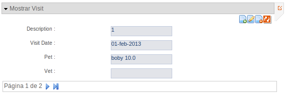

Add-on Web Screen Patterns
--------------------------

//Push down level title
:leveloffset: 2

Add-on para aplicar patrones de visualización sobre entidades y sus
relaciones.

¿Qué entendemos por patrón de visualización?
http://designingwebinterfaces.com/designing-web-interfaces-12-screen-patterns["12
patrones de pantalla estándar"]

Las opciones de este add-on _no son compatibles con el
link:#addon-web-mvc_jquery[add-on web mvc de jQuery] ni con
link:#addon-web-mvc-datatables[add-on web mvc datatables]_.

Descripción
-----------

El add-on permite aplicar patrones de visualización sobre una entidad
determinada del proyecto y una o varias de sus relaciones con otras
entidades. Los patrones actualmente soportados son:

* Maestro tabular
* Maestro tabular con edición registro
* Maestro registro
* Maestro registro - Detalle tabular
* Maestro registro - Detalle tabular con edición registro
* Maestro tabular - Detalle tabular
* Maestro tabular - Detalle tabular con edición registro
* Maestro tabular con edición registro - Detalle tabular
* Maestro tabular con edición registro - Detalle tabular con edición
registro

Cuando un patrón maestro tiene algún detalle, el detalle de una entidad
se corresponde con las relaciones 1 a n _ONE_TO_MANY_ o las relaciones n
a n _MANY_TO_MANY_ que tiene con otras entidades. Así mismo, un maestro
puede tener múltiples detalles y serán visualizados en la parte inferior
de la pantalla mediante una pestaña por cada una de las relaciones.

Instalación
-----------

El add-on ofrece el comando
link:#apendice-comandos_addon-web_mvc_pattern_setup[web mvc pattern
setup] que crea en el proyecto los ficheros que utilizarán los patrones
de visualización.

* Nuevas librerías de tags e inclusión de nuevos tags en librerías
existentes
* Imágenes utilizadas para mostrar distintos controles y mensajes
* Librerías javascript para realizar ciertas acciones en el lado cliente
* Hojas de estilo css con la definición de los estilos visuales
* Propiedades para el soporte de múltiples idiomas

Este comando solo estará disponible para la inicialización de los
artefactos. Si se desea restaurar los artefactos o acualizarlos después
de un cambio de versión del add-on es necesario utilizar el comando
link:#apendice-comandos_addon-web_mvc_pattern_update_tags[web mvc
pattern update tags].

La ejecución del comando realizará las siguientes modificaciones en el
proyecto.

----------------------------------------------------------------------------------
roo-gvNIX>
    Created SRC_MAIN_WEBAPP/images/pattern
    Created SRC_MAIN_WEBAPP/images/pattern/enEdicion.gif
    Created SRC_MAIN_WEBAPP/images/pattern/pedi_off.gif
    Created SRC_MAIN_WEBAPP/images/pattern/pedi_on.gif
    Created SRC_MAIN_WEBAPP/images/pattern/pfil_off.gif
    Created SRC_MAIN_WEBAPP/images/pattern/pfil_on.gif
    Created SRC_MAIN_WEBAPP/images/pattern/plis_off.gif
    Created SRC_MAIN_WEBAPP/images/pattern/plis_on.gif
    Created SRC_MAIN_WEBAPP/images/pattern/refresh.gif
    Created SRC_MAIN_WEBAPP/scripts
    Created SRC_MAIN_WEBAPP/WEB-INF/tags/dialog/message
    Created SRC_MAIN_WEBAPP/WEB-INF/tags/pattern
    Created SRC_MAIN_WEBAPP/WEB-INF/tags/pattern/form
    Created SRC_MAIN_WEBAPP/WEB-INF/tags/pattern/form/fields
    Created SRC_MAIN_WEBAPP/WEB-INF/i18n/messages_ca.properties
    Updated SRC_MAIN_WEBAPP/WEB-INF/i18n/messages_ca.properties
    Updated SRC_MAIN_WEBAPP/WEB-INF/i18n/messages_es.properties
    Updated SRC_MAIN_WEBAPP/WEB-INF/i18n/messages.properties
    Created SRC_MAIN_WEBAPP/scripts/quicklinks.js
    Created SRC_MAIN_WEBAPP/styles/pattern.css
    Created SRC_MAIN_WEBAPP/WEB-INF/tags/util/changes-control.tagx
    Created SRC_MAIN_WEBAPP/WEB-INF/tags/util/panel-tab.tagx
    Created SRC_MAIN_WEBAPP/WEB-INF/tags/util/panel-tabs.tagx
    Created SRC_MAIN_WEBAPP/WEB-INF/tags/util/quicklink.tagx
    Created SRC_MAIN_WEBAPP/WEB-INF/tags/util/quicklinks.tagx
    Created SRC_MAIN_WEBAPP/WEB-INF/tags/util/slider.tagx
    Created SRC_MAIN_WEBAPP/WEB-INF/tags/dialog/message/message-box.tagx
    Created SRC_MAIN_WEBAPP/WEB-INF/tags/pattern/cancelbutton.tagx
    Created SRC_MAIN_WEBAPP/WEB-INF/tags/pattern/contentpane.tagx
    Created SRC_MAIN_WEBAPP/WEB-INF/tags/pattern/hiddengvnixpattern.tagx
    Created SRC_MAIN_WEBAPP/WEB-INF/tags/pattern/paginationadd.tagx
    Created SRC_MAIN_WEBAPP/WEB-INF/tags/pattern/paginationview.tagx
    Created SRC_MAIN_WEBAPP/WEB-INF/tags/pattern/relation.tagx
    Created SRC_MAIN_WEBAPP/WEB-INF/tags/pattern/relations.tagx
    Created SRC_MAIN_WEBAPP/WEB-INF/tags/pattern/tabcontainer.tagx
    Created SRC_MAIN_WEBAPP/WEB-INF/tags/pattern/form/show.tagx
    Created SRC_MAIN_WEBAPP/WEB-INF/tags/pattern/form/update.tagx
    Created SRC_MAIN_WEBAPP/WEB-INF/tags/pattern/form/updateregister.tagx
    Created SRC_MAIN_WEBAPP/WEB-INF/tags/pattern/form/fields/checkbox.tagx
    Created SRC_MAIN_WEBAPP/WEB-INF/tags/pattern/form/fields/contentpane.tagx
    Created SRC_MAIN_WEBAPP/WEB-INF/tags/pattern/form/fields/datetime.tagx
    Created SRC_MAIN_WEBAPP/WEB-INF/tags/pattern/form/fields/input.tagx
    Created SRC_MAIN_WEBAPP/WEB-INF/tags/pattern/form/fields/select-withempty.tagx
    Created SRC_MAIN_WEBAPP/WEB-INF/tags/pattern/form/fields/select.tagx
    Created SRC_MAIN_WEBAPP/WEB-INF/tags/pattern/form/fields/selectFinder.tagx
    Created SRC_MAIN_WEBAPP/WEB-INF/tags/pattern/form/fields/selectRelated.tagx
    Created SRC_MAIN_WEBAPP/WEB-INF/tags/pattern/form/fields/simple.tagx
    Created SRC_MAIN_WEBAPP/WEB-INF/tags/pattern/form/fields/textarea.tagx
----------------------------------------------------------------------------------

Algunos de los componentes que se incluyen en el proyecto no son
utilizados automáticamente por los patrones de visualización, sino que
serán útiles para modificar el comportamiento de ciertas funcionalidades
en la aplicación.

Creación de un patrón
---------------------

El add-on proporciona una serie de anotaciones que sirven para definir
patrones de visualización sobre el controlador de una entidad de la
aplicación. Por comodidad se han definido una serie de
link:#apendice-comandos_web-relation-styles[comandos] para facilitar la
aplicación de estas anotaciones en las clases Java necesarias.

Al definir un patrón de visualización sobre un controlador, se está
definiendo un patrón maestro para la entidad gestionada por dicho
controlador. Al definir un patrón de visualización sobre un controlador
y una relación, se está definiendo un patrón detalle para la entidad
relacionada.

_Advertencia:_ Actualmente, este add-on solo soporta controladores cuya
entidad sea un _Active record_ (que son aquellas que tengan declarada la
notación `@RooJpaActiveRecord`).

Suponiendo el siguiente escenario codificado en Java :

---------------------------
@RooJpaActiveRecord
    public class Entidad1 {
      @OneToMany
      Set<Entidad2> campo2;
      @OneToMany
      Set<Entidad3> campo3;
      ...
    }

    @RooJpaActiveRecord
    public class Entidad2 {
      ...
    }
---------------------------

El código anterior declara una _Entidad1_ que tiene un _campo2_ que
define a su vez una relación 1 a n con la _Entidad2_, lo mismo con la
relación definida en el _campo3_. La _Entidad1_ está expuesta mediante
el _Controlador1_, a su vez la _Entidad2_ lo está mediante el
_Controlador2_.

----------------------------------------------------------
@RooWebScaffold(..., formBakingObject=Entidad1.class)
    @Controller
    public class Controlador1 {
      ...
    }

    @RooWebScaffold(..., formBackingObject=Entidad2.class)
    @Controller
    public class Controlador2 {
      ...
    }

----------------------------------------------------------

Creación de un patrón maestro
~~~~~~~~~~~~~~~~~~~~~~~~~~~~~

Mediante el commando
link:#apendice-comandos_addon-web_mvc_pattern_master[web mvc pattern
master] es posible definir un patrón de visualización maestro sobre el
controlador de cualquier entidad. Al usar el comando, además de añadir
la anotación _@GvNIXPattern_ al controlador elegido, se instalarán /
crearán / modificarán los componentes Spring MVC necesarios (diferentes
archivos tagx, jspx, imágenes, javascript, ...) y se generarán los
aspectos Java apropiados para lograr visualizar el patrón elegido.

image:images/tabular.png[Patrón maestro]

Creación de un patrón detalle
~~~~~~~~~~~~~~~~~~~~~~~~~~~~~

El comando
link:#apendice-comandos_addon-web_mvc_relation_pattern_detail[web mvc
pattern detail] permite definir el formato de visualización del detalle
de una entidad dado su controlador, esto es, como se visualizarán las
entidades relacionadas al visualizar la entidad maestra. Notar que el
comando se aplica sobre un campo, una relación, determinada de la
entidad maestra (en el ejemplo propuesto, se aplicaría el comando una
vez sobre _campo2_ y opcionalmente otra vez sobre _campo3_). Este
comando también instala / crea / modifica componentes Spring MVC, añade
la anotación _@GvNIXRelationsPattern_ en el controlador de la entidad
maestra y añade la anotación _@GvNIXRelatedPattern_ sobre el controlador
de la entidad detalle. Estas anotaciones harán que se genere, en caso
necesario, los aspectos Java que hacen posible la visualización del
patrón seleccionado.

Para aplicar un patrón detalle sobre un controlador, es necesario
definir previamente un patrón maestro sobre el mismo controlador. Es
decir, el controlador debe tener definida la anotación _@GvNIXPattern_.

image:images/master-detail.png[Patrón maestro con un detalle]

Tipos de patrones
-----------------

Tabular
~~~~~~~

Este patrón se identifica mediante el código _tabular_.

El patrón tabular define una visualización de varios registros
simultaneos con la posibilidad de desplazarse a lo largo de todos los
registros existentes mediante paginación.

image:images/tabular.png[Tabular]

Las operaciones de creación, actualización y borrado en este formato de
visualización se pueden realizar sobre varios registros de forma
simultánea. Estas operaciones se realizarán de forma transaccional, con
lo que el fallo de una operación sobre un registro provocaría que todo
el proceso fallase y todos los registros involucrados en la operación
permanecerían inalterados.

El Add-on Web Screen Pattern, genera los componentes necesarios para
mostrar una entidad en formato tabular. Por defecto, la jspx asociada a
este patrón utiliza el componente _<form:update/>_ de la librería de
tags _/pattern/form_.

Este formato de visualización por defecto muestra y habilita el campo
que representa el identificador de la entidad en el formulario de
creación y actualización. En ocasiones esto puede ser útil en entidades
en las que el identificador haya de ser establecida a mano por el
usuario. Otras veces, en cambio, se desea que el identificador sea
generado automáticamente. El tagx _<form:update/>_ dispone de un
atributo *idDisabled* que establecido con el valor _true_, deshabilita
el campo en los formularios de forma que el usuario no puede establecer
ningún valor en este campo para evitar confusiones, pues será el
proveedor de persistencia el que se ocupe de establecer el valor de este
campo usando la generación automática de identificadores. También se
espera que el campo identificador de la entidad sea el campo con nombre
_id_, si por algún motivo no fuese el caso, se puede indicar el campo
que hace las veces de identificador mediante el atributo *idField*.

Otro atributo con el que cuenta el tagx de update es el atributo
*finder* cuyo valor indica un buscador al que se podrá acceder mediante
la _pestaña lupa_ que se muestra a la derecha de la caja principal de la
vista del patrón tabular.

Este componente acepta, entre otros, algunos atributos interesantes:

* _list = true|false_ indica si se desea mostrar una pestaña con la
imagen de una tabla en la parte derecha de la pantalla que permite
acceder a este patrón. Es útil para volver a este patrón si en la misma
pantalla se permite visualizar la misma información con distintos
patrones o tiene un buscador asociado. Por defecto, su valor será
_true_.
* _createLink = true|false_ booleano que indica si se debe permitir la
creación de nuevos registros desde el patrón.
* _updateLink = true|false_ booleano que indica si se debe permitir la
actualización de registros existentes desde el patrón.
* _deleteLink = true|false_ booleano que indica si se debe permitir el
borrado de registros existentes desde el patrón.
* _resetLink = true|false_ booleano que indica si se debe permitir
refrescar la lista de registros existentes en el patrón.
* _checkSelect = true|false_ booleano que indica si se debe mostrar un
campo de selección a la izquierda de cada uno de los registros del
patrón para marcar uno o varios de ellos.
* _finder = NombreBuscador_ si está establecido, se mostrará una pestaña
con la imagen de una lupa en la parte derecha de la pantalla que permite
acceder al buscador indicado en el valor del atributo. Es útil para
realizar un filtrado de los datos que se están mostrando en el patrón.
Por defecto, no tiene valor alguno y por lo tanto no mostrará la
pestaña. Por ejemplo, _finder="ByOwner"_.
* _idRender = true|false_ booleano que indica si el campo identificador
se debe ver en pantalla.
* _idDisabled = true|false_ booleano que indica si el campo
identificador debe estar desactivado, es decir, el usuario no debe poder
modificarlo.
* _roles = ListaRoles_ Lista separada por comas con los roles que tienen
permiso para realizar las operaciones de creación, actualización,
borrado y refresco de los registros del patrón. Este atributo solo es
útil si se encuentra aplicada la seguridad, por ejemplo mediante el
link:#addon-cit-security[add-on CIT Security] o el add-on Typical
security.

Tabular con edición registro
~~~~~~~~~~~~~~~~~~~~~~~~~~~~

Este patrón se identifica mediante el código _tabular_edit_register_.

El patrón tabular define una visualización de varios registros
simultaneos con la posibilidad de desplazarse a lo largo de todos los
registros existentes mediante paginación.

image:images/tabular.png[Tabular]

Las operaciones de creación, actualización y borrado en este formato de
visualización se realizan sobre un único registro seleccionado de la
lista tabular y se realiza en una página nueva en formato registro.

image:images/edit.png[Edición]

El Add-on Web Screen Pattern, genera los componentes necesarios para
mostrar una entidad en formato tabular con edición registro. Por
defecto, la jspx asociada a este patrón utiliza el componente
_<form:updateregister/>_ de la librería de tags _/pattern/form_.

Este formato de visualización por defecto muestra el campo que
representa el identificador. En ocasiones esto puede ser útil en
entidades en las que el identificador se quiera visualizar. Otras veces,
en cambio, se desea que el identificador permanezca oculto. El tagx
_<form:updateregister/>_ dispone de un atributo *idRender* que
establecido con el valor _false_, oculta el campo. También se espera que
el campo identificador de la entidad sea el campo con nombre _id_, si
por algún motivo no fuese el caso, se puede indicar el campo que hace
las veces de identificador mediante el atributo *idField*.

Otro atributo con el que cuenta el tagx de updateregister es el atributo
*finder* cuyo valor indica un buscador al que se podrá acceder mediante
la _pestaña lupa_ que se muestra a la derecha de la caja principal de la
vista del patrón tabular.

Este componente acepta, entre otros, algunos atributos interesantes:

* _list = true|false_ indica si se desea mostrar una pestaña con la
imagen de una tabla en la parte derecha de la pantalla que permite
acceder a este patrón. Es útil para volver a este patrón si en la misma
pantalla se permite visualizar la misma información con distintos
patrones o tiene un buscador asociado. Por defecto, su valor será
_true_.
* _createLink = true|false_ booleano que indica si se debe permitir la
creación de nuevos registros desde el patrón.
* _updateLink = true|false_ booleano que indica si se debe permitir la
actualización de registros existentes desde el patrón.
* _deleteLink = true|false_ booleano que indica si se debe permitir el
borrado de registros existentes desde el patrón.
* _resetLink = true|false_ booleano que indica si se debe permitir
refrescar la lista de registros existentes en el patrón.
* _checkSelect = true|false_ booleano que indica si se debe mostrar un
campo de selección a la izquierda de cada uno de los registros del
patrón para marcar alguno de ellos.
* _finder = NombreBuscador_ si está establecido, se mostrará una pestaña
con la imagen de una lupa en la parte derecha de la pantalla que permite
acceder al buscador indicado en el valor del atributo. Es útil para
realizar un filtrado de los datos que se están mostrando en el patrón.
Por defecto, no tiene valor alguno y por lo tanto no mostrará la
pestaña. Por ejemplo, _finder="ByOwner"_.
* _idRender = true|false_ booleano que indica si el campo identificador
se debe ver en pantalla.
* _roles = ListaRoles_ Lista separada por comas con los roles que tienen
permiso para realizar las operaciones de creación, actualización,
borrado y refresco de los registros del patrón. Este atributo solo es
útil si se encuentra aplicada la seguridad, por ejemplo mediante el
link:#addon-cit-security[add-on CIT Security] o el add-on Typical
security.

Registro
~~~~~~~~

Este patrón se identifica mediante el código _register_.

Este patrón realiza la visualización de un único registro pero con la
posibilidad de avanzar, mediante paginación de uno en uno, entre todos
los registros existentes.

La generación automática de código de este patrón posiciona los campos
de la entidad unos debajo de otros. A parte de generar la jspx propia
del patrón, también modifica las jspx _create, update y show_ de la
entidad. En todas estas jspx los campos de la entidad se incrustan
dentro de elementos HTML de tipo lista
_<ul><li>campo_entidad</li></ul>_. Con esto se permite personalizar la
posición de cada uno de los campos de la entidad en estas jspx moviendo
los elementos _<li>campo_entidad</li>_ dentro de otros elementos _<ul/>_
de forma que los campos se mostrarán en columnas. El CSS de la
aplicación está preparado para ello.

Por ejemplo, para el siguiente código extraído de _show.jspx_:

-----------------------------------------------------------------------------------
<ul class="formInline" id="ul_com_springsource_petclinic_domain_Pet_name">
  <li class="size120" id="li_com_springsource_petclinic_domain_Pet_name">
    <field:input field="name" id="c_com_springsource_petclinic_domain_Pet_name"
            min="1" required="true" z="ZY+k75JeSo9RmejYZRFNIvs2aBg="/>
  </li>
</ul>
<ul class="formInline" id="ul_com_springsource_petclinic_domain_Pet_weight">
  <li class="size120" id="li_com_springsource_petclinic_domain_Pet_weight">
    <field:input field="weight" id="c_com_springsource_petclinic_domain_Pet_weight"
            min="0" required="true" validationMessageCode="field_invalid_number"
            z="cOD5zE/z7gy+RZu5kVSPuxCa+/I="/>
  </li>
</ul>
-----------------------------------------------------------------------------------

donde los campos _name_ y _weight_ se visualizan uno debajo de otro, se
puede modificar por:

-----------------------------------------------------------------------------------
<ul class="formInline" id="ul_com_springsource_petclinic_domain_Pet_name">
  <li class="size120" id="li_com_springsource_petclinic_domain_Pet_name">
    <field:input field="name" id="c_com_springsource_petclinic_domain_Pet_name"
            min="1" required="true" z="ZY+k75JeSo9RmejYZRFNIvs2aBg="/>
  </li>
  <li class="size120" id="li_com_springsource_petclinic_domain_Pet_weight">
    <field:input field="weight" id="c_com_springsource_petclinic_domain_Pet_weight"
            min="0" required="true" validationMessageCode="field_invalid_number"
            z="cOD5zE/z7gy+RZu5kVSPuxCa+/I="/>
  </li>
</ul>
-----------------------------------------------------------------------------------

donde los campos _name_ y _weight_ se visualizan uno junto al otro en la
misma fila.

La jspx propia del patrón registro usa el componente _show.tagx_ de la
librería de tags_pattern_.

-------------------------------------------------------------------------------------
<page:show id="ps_com_springsource_petclinic_domain_Pet" object="${pet}" path="/pets"
            z="FrMAP8iVoUnyo/I+XWaK7GumSjc=">
-------------------------------------------------------------------------------------

Este componente acepta algunos atributos interesantes:

* _list = true|false_ indica si se desea mostrar un icono que da acceso
mediante un enlace a la vista list de la Entidad.
* _create = true|false_ indica si se desea mostrar el icono que da
acceso al formulario de creación de un nuevo registro.
* _update = true|false_ indica si se desea mostrar el icono que enlaza
con el formulario de edición del registro visualizado.
* _delete = true|false_ indica si se desea habilitar el borrado de
registros desde esta vista.
* _finder = NombreBuscador_ (ejemplo _finder="ByOwner"_) si está
establecido, en la vista del patrón registro se mostrará un enlace que
llevará al buscador indicado por el valor del atributo. Este enlace se
representa mediante una _pestaña con una lupa_, a la derecha de la caja
principal de la vista del patrón.
* _roles = ListaRoles_ Lista separada por comas con los roles que tienen
permiso para realizar las operaciones de creación, actualización,
borrado y refresco de los registros del patrón. Este atributo solo es
útil si se encuentra aplicada la seguridad, por ejemplo mediante el
link:#addon-cit-security[add-on CIT Security] o el add-on Typical
security.

//Return level title
:leveloffset: 0
