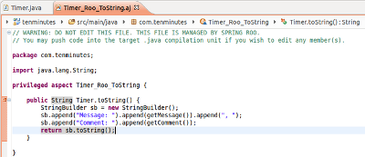

Desarrollo con Eclipse
----------------------

//Push down level title
:leveloffset: 2

Instalación
-----------

Spring ha desarrollado una extensión para Eclipse llamada SpringSource
Tool Suite o STS, que ofrece soporte para trabajar en Eclipse con
aplicaciones de Spring, entre ellas Spring Roo y por tanto gvNIX. Entre
otras funcionalidades incorpora un intérprete de comandos de Roo que
permite ejecutar órdenes sin necesidad de salir de Eclipse.

Hay dos formas de instalar STS, la primera es como una distribución
propia y la segunda es como un plugin de un Eclipse ya existente. Se
recomienda encarecidamente utilizar la primera de ellas por su facilidad
de instalación y mejor rendimiento.

STS como distribución
~~~~~~~~~~~~~~~~~~~~~

__Para instalar el IDE como una distribución propia realizar los
siguientes pasos:__

* Descargar la última versión de Springsource Tool Suite desde
link:#[http://spring.io/tools]
* Descomprimir el archivo descargado y moverlo a una carpeta, por
ejemplo $HOME/software.
* Ejecutar STS
($HOME/software/springsource-X.X.X/sts-X.X.X.RELEASE/STS). Tener en
cuenta que STS es una aplicación Java por lo que requiere tener una
máquina virtual Java instalada en el sistema.

STS como plugin
~~~~~~~~~~~~~~~

__Para instalar el IDE en un Eclipse existente seguir los siguientes
pasos:__

* Si no se dispone todavía de él, descargar Eclipse IDE for Java EE
Developers de link:#[http://www.eclipse.org/downloads/]
* Crear la variable de classpath de Eclipse M2_REPO, para ello:
1.  *_Window > Preferences > Java > Build Path
                  > Classpath Variables_*, botón __`New...`__.
2.  Definir los siguientes valores:
** __`Name`__ = __`M2_REPO`__.
** __`Path`__ = directorio correspondiente al repositorio de Maven
(normalmente en Unix: $HOME/.m2/repository)
3.  _Ok_ para crear la variable, y _Ok_ de nuevo para cerrar la ventana
de preferencias y guardar cambios.
* Instalar plugin M2Eclipse para Eclipse
(http://m2eclipse.sonatype.org/installing-m2eclipse.html)
+
En el menú Help > Install New Software, en el campo de texto "Work
with:" indicar que se usará el site:
link:#[http://m2eclipse.sonatype.org/sites/m2e]. A continución
eleccionar "Maven Integration for Eclipse". Pulsar en siguiente y tras
aceptar la licencia del plugin instalar.
* Activa la opción __`Enable Window > Preferences > General >
              Workspace > Refresh Automatically`__.
* Opcionalmente, instalar el plugin Subeclipse para trabajar sobre el
sistema de control de versiones Subversion (SVN).
+
Para ello en Eclipse, en el menú _Help > Install New Software_. En la
ventana que se abre hacer click sobre el botón _Add_ que hay a la
derecha de _Work with_. Se abre un diálogo en el que se indicará como
nombre Subeclipse por ejemplo y en la URL indicar
_http://subclipse.tigris.org/update_1.6.x_ guardar con _OK_ y la ventana
anterior empezará la carga de los plugins que hay disponibles.
Seleccionarlos y seguir haciendo click en _Next_. La URL indicada es de
la versión actual, revisar el sitio oficial de http://subclipse.tigris.org/[Subeclipse] para
más información y futuras versiones.
* Para instalar el plugin STS seguir las instrucciones del punto "UPDATE
SITE INSTALLATION" del documento _Spring Source Tool Suite Installation
Instructions_.

Integrar soporte ROO en STS
~~~~~~~~~~~~~~~~~~~~~~~~~~~

Spring Roo ya no está incluido en la distribución de STS a partir de su
versión _3.6.0_, por ello necesitaremos instalar este soporte para poder
trabajar con gvNIX.

Para incluir este soporte, sigue los siguientes pasos:

1.  Abre tu STS
2.  Abre el dashboard del STS y busca Spring ROO
3.  Instala _Spring Roo (current production release)_ y _Spring IDE -
Roo Extension_
4.  Reinicia tu STS

image::./images/sts_install.jpeg[Integrando soporte ROO en STS,align=center]

Consola gvNIX / Roo integrada en Eclipse
----------------------------------------

El plugin o distribución de STS instalado ofrece la posibilidad de
incluir la consola de gvNIX en el propio entorno de desarrollo. Para
ello antes hay que indicarle a Eclipse donde está instalada la nueva
versión de gvNIX.

En el menú _Window > Preferences > Spring > Roo Support_. Pulsar sobre
el botón Add y buscar en el navegador de archivos el lugar donde está
instalado gvNIX. Aparecerá una pantalla similar a la siguiente:

image::./images/preferences_roo.png[Configuración del soporte gvNIX en Eclipse, align=center]

Presionando en OK sobre las dos pantallas que abiertas ya estará
configurado el soporte para la linea de comandos de gvNIX. Para poder
usarlo abrir la perspectiva de Spring con _Window > Open Perspective >
Other > Spring_. En la parte inferior de la pantalla aparecerá una
pestaña llamada Roo Shell. Si no apareciese la pestaña, puede abrirse
seleccionando _Window > Show View > Roo Shell._

Para abrir la consola pulsar en el botón que aparece en la parte
superior derecha de la pestaña con el título _Open Roo Shell._ Entonces
seleccionar el proyecto en el que se va a trabajar y ya se puede empezar
a ejecutar comandos. Si no se dispone todavía de ningún proyecto, en el
punto siguiente se verá como crear un nuevo proyecto.

La ejecución de comandos también se puede hacer de forma gráfica
pulsando en el botón que aparece en la parte superior derecha de la
pestaña con el título Open Roo Command Wizard.

image::./images/eclipse_gvNIX_shell.png[Consola gvNIX en Eclipse, align=center]

[NOTE]
====
Hay que tener en cuenta una pequeña diferencia a la hora de usar la
línea de comandos desde Eclipse con respecto a la linea de comandos de
gvNIX en la consola del sistema. Mientras en una consola del sistema se
utiliza la tecla TAB para completar los comandos, en el IDE se utilizará
Ctrl+Space que es el atajo por defecto usado en Eclipse.
====

Utilizar Eclipse como IDE
-------------------------

Crear proyecto gvNIX en Eclipse IDE
~~~~~~~~~~~~~~~~~~~~~~~~~~~~~~~~~~~

Crear un proyecto gvNIX desde Eclipse a través del menú: __File > New >
Spring Roo Project__:

image::./images/eclipse_new_roo_project.png[Nuevo proyecto Spring Roo con soporte gvNIX, align=center]

Esta primera pantalla habrá ejecutado de forma automática el comando de
creación de un nuevo proyecto:

----------------------------------------------
project --topLevelPackage com.gvnix.tenminutes
----------------------------------------------

En este punto ya se dispone de un proyecto Maven preparado.

A continuación, añadir el soporte para el manejo de la persistencia de
datos a través de JPA. El siguiente ejemplo muestra los comandos que se
deben usar para configurar el soporte JPA. Recordar que se puede usar
Ctrl+Space como ayuda a la escritura en los comandos:

-------------------------------------------------------------------------
roo-gvNIX> jpa setup --provider HIBERNATE --database HYPERSONIC_IN_MEMORY
Created ...
roo-gvNIX> entity jpa --class ~.domain.Timer --testAutomatically
Created ...
~.domain.Timer roo-gvNIX> field string --fieldName message --notNull
Managed ...
-------------------------------------------------------------------------

El comando *jpa setup* permite configurar la capa de acceso a datos de
manera sencilla. El comando *entitiy jpa* sirve para crear una nueva
entidad y *field* crea atributos en la entidad. Estos comandos se verán
con más detalle en la sección
link:#_persistencia_de_objetos[Persistencia de
objetos] y
link:#guia-desarrollo_gestion-entidades_definicion_crear-con-comando[Crear
una entidad con el intérprete de comandos], también se verá como generar
todas las entidades de una aplicación mediante el proceso de ingeniería
inversa contra un esquema de BBDD existente.

-----------------------------------------------------
~.domain.Timer roo-gvNIX> web mvc setup
~.domain.Timer roo-gvNIX> web mvc all --package ~.web
Created ...
-----------------------------------------------------

Los comandos *web mvc* crean la capa capa web que gestionaran la
interacción del usuario con la aplicación. Se verán con más detalle en
link:#_web_mvc_controller[Crear la capa web con el
intérprete de comandos].

------------------------------------------------------
~.web roo-gvNIX> selenium test --controller ~.web.Time
------------------------------------------------------

Importar proyecto gvNIX en Eclipse
~~~~~~~~~~~~~~~~~~~~~~~~~~~~~~~~~~

gvNIX/Roo permite crear proyectos desde la linea de comandos, aunque
puede suceder que se necesite importar un proyecto ya existente en el
IDE. Si se está ejecutando gvNIX en la línea de comandos, bastaría con
ejecutar el comando `perform eclipse` para crear una estructura de
proyecto Eclipse:

-------------------------------
~.domain.PizzaOrder roo-gvNIX>

~.domain.PizzaOrder roo-gvNIX>
-------------------------------

Este comando termina ejecutando el comando del
sistema`mvn eclipse:eclipse` en el proyecto, por lo que es indiferente
el uso de cualquiera de los dos métodos. Tener en cuenta que este último
comando necesita tener configurado Maven.

Ahora se puede importar en el entorno de trabajo mediante
`File > Import > General > Existing Projects
      into workSpace`. Si aparece el mensaje _Turn Weaving Service on?_,
marcar la casilla _Don't ask again until next upgrade_ y clic en _Yes_
(será necesario reiniciar Eclipse).

También es posible borrar la configuración de eclipse ejecutando el
comando `mvn eclipse:clean` en una consola del sistema que tenga
configurada Maven. Para regenerar la configuración de eclipse en un solo
comando usar `mvn eclipse:clean eclipse:eclipse`.

Al importar un proyecto en Eclipse es importante comprobar que dicho
proyecto tiene configuradas las características de proyecto Maven y
proyecto de aspectos java. Esto aparece de forma visual en el proyecto
mediante unas pequeñas letras M y AJ. Si no apareciesen se pueden añadir
estas características seleccionando el proyecto y con el segundo botón
del ratón eligiendo la opción _Configure_. Esto es muy importante ya que
en el caso de no estar correctamente configurado nos aparecerán falsos
errores en el proyecto.

Generación de pruebas de integración
------------------------------------

El comando _entity jpa_ dispone de la opción testAutomatically que al
ser especificada generará los test de integración para dicha entidad
usando JUnit.

Si los tests no fueron creados en el momento de la ejecución del comando
_entity_, pueden ser generados con posterioridad mediante otro comando:

--------------------------------------------
    test integration --entity ~.domain.Timer

--------------------------------------------
Arrancar la aplicación con Eclipse
----------------------------------

Es posible arrancar la aplicación desde el propio Eclipse y, además de
permitir depurarla, permite hacer cambios en caliente sobre la
aplicación.

Para ello, debemos tener la aplicación importada en un _workspace_ de
Eclipse y configurar el servidor dónde ejecutarlo. Eclipse es capaz de
gestionar distinto tipos de servidores, generando sus propios directorio
y ficheros de configuración.

Para prepara un servidor seguir los siguiente pasos:

Mostrar la Vista de Servidores en Eclipse
~~~~~~~~~~~~~~~~~~~~~~~~~~~~~~~~~~~~~~~~~

Eclipse tiene una vista que permite ver los distintos servidores
configurados y gestionarlos desde ahí. Estos son los pasos para mostrar
la vista

1.  Abra la opción del menú `Window > Show view >
          Other..`..
2.  Busque la vista llamada `Servers` y pulse el botón `Ok`.

Crear un nuevo Servidor
~~~~~~~~~~~~~~~~~~~~~~~

Se pueden definir múltiples entornos de ejecución para los servidores.
Esta configuración incluye el tipo de servidor (Tomcat, Jetty, JBoss,
etc..), Máquina Virtual Java (JRE 1.5, JRE 1.6, etc...) y la ruta a los
binarios del servidor.

Cabe destacar que eclipse *no usa la configuración que exista en la
instalación del servidor* en la mayoría de los casos. Solo usa los
ejecutables para arrancarlo con ficheros de configuración que almacena
en el propio workspace.

En este caso, vamos a preparar el entorno para Tomcat 6 siguiendo los
pasos indicados a continuación:

1.  Dentro de la pestaña Servers, pinchar con el segundo botón del ratón
y seleccionar New > Server.

2.  Seleccionar `Apache Tomcat
          v6.0 Server` de la lista de tipos y pulsar el botón `Next`.
+
En el caso en que no aparezca ningún tipo de servidor o no aparezcan los
de Apache Tomcat se ha de realizar lo siguiente:

* Ir a `Help > Install New
              Software...`.
* Desmarcar la casilla "_Hide items that are already installed._"
* En "_Work With_" seleccionar el sitio "_Eclipse Web Tools Platform
Repository_ - _http://download.eclipse.org/webtools/updates/_" (si no
aparece, añadirlo usando el botón `Add...`.)
* En el listado de software desplegar `Web Tools
              Platform Tests (WST Tests)` (si hay más de un _WST Tests_
seleccionar el de la última versión).
* Instalar (seleccionándolos) `WST Server
              tests` y `JST Server Tests` (si ya están instalado
aparecerá su icono en gris)

3.  Introducir un nombre para la configuración.
4.  Seleccionar el directorio donde se encuentra una instalación de
Tomcat 6. Si no se dispone de ninguna instalación de Tomcat 6 crear un
nuevo directorio, seleccionarlo y pulsar sobre el botón Download and
Install ... que pasados unos segundos terminará la descarga y permitirá
continuar.
5.  Seleccionar la máquina virtual Java con la que ejecutar el servidor.
6.  Pulsar el botón Next.
7.  Añadir las aplicaciones a ejecutar en este servidor de entre las
disponibles.

Ajustar la configuración del Servidor
~~~~~~~~~~~~~~~~~~~~~~~~~~~~~~~~~~~~~

Puede ser necesario ajustar algunas opciones de la configuración del
servidor. Para poder acceder a dichas opciones hay que seleccionar el
servidor desde la pestaña de servidores y, con el botón derecho del
ratón sobre él pulsar `Open`.

Desde el panel abierto podremos gestionar:

* Datos generales del servidor.
* Opciones de publicación y seguridad.
* TimeOuts (muy útil si se está depurando algún proceso de arranque).
* Puertos
* Configuración de tipos MIME.
* Las aplicaciones/modulos a lanzar (admite módulos externos).
* Configuración de arranque del servidor.
+
El servidor Tomcat arranca con cierta cantidad de memoria que no
soportar mas de 4 cambios en el proyecto antes de llenarse y dejar de
funcionar. Para evitar esto, se puede incrementar la cantidad de memoria
con la que arranca Tomcat.

[IMPORTANT]
====
Es muy interesante modificar los parámetros de memoría con los que
trabaja el servidor. Para ello:

* En la pantalla de opciones de la configuración del servidor acceder a
_Open launch configuration_
* En la nueva ventana, en la pestaña _Arguments_ añadir al final del
texo que aparece en el apartado _VM Arguments_ lo siguiente:
`-Xms64m -Xmx256m -XX:MaxPermSize=128m
            -XX:PermSize=128m`
====

Ejecución de la aplicación en el Servidor
~~~~~~~~~~~~~~~~~~~~~~~~~~~~~~~~~~~~~~~~~

Una vez configurado el servidor, se podrá añadir a este la aplicación
que se desea ejecutar en él. Se puede ejecutar más de una a la vez. En
la vista Servers, pulsar con el botón derecho sobre el servidor deseado
y seleccionar la opción _Add and Remove ..._. En el diálogo que se abre
seleccionar de la lista de la izquierda la aplicación y pulsar el botón
_Add_. Por último, cerrar el diálogo con _Finish_.

image::./images/eclipse_servers-addremoveapp.png[Añadir / Eliminar aplicaciones al Servidor, align=center]

Ya es posible arrancar el servidor y probar la aplicación.

image::./images/eclipse_servers.png[Vista de servidores disponibles en el workspace de Eclipse, align=center]

En la imagen anterior se observa un servidor Tomcat 6 con la aplicación
_tenminutes_ disponible para ejecutar. Con los botones disponibles se
puede arrancar la aplicación en modo debug, arrancar la aplicación de
manera normal (botón verde con triángulo blanco en el centro), arrancar
en modo profile, pararlo o re-publicar los cambios del proyecto en el
servidor.

Una vez arrancado el servidor se podrá navegar por la aplicación bien
desde un navegador externo (Firefox) o bien desde un navegador propio
que incorpora Eclipse accediendo a la dirección
link:#[http://localhost:8080/tenminutes]. Observar que el final de la
dirección se corresponde con el nombre de la aplicación proporcionado al
crear el proyecto. Para abrir el navegador interno de Eclipse utilizar
_Window > Show view > Internal Web Browser_.

image::./images/eclipse_browser.png[Navegador interno de Eclipse , align=center]

Ejecutar la apliación desde Eclipse puede ser muy útil a la hora de
hacer cambios en el proyecto, modificaciones en las vistas, en los
objetos de aplicación, bien desde el propio IDE o desde la línea de
comandos de gvNIX, ya que automáticamente se verán reflejados los
cambios en el navegador.

Trabajando con el código de la aplicación en Eclipse
----------------------------------------------------

Al generar un proyecto con gvNIX/Roo habrá que trabajar sobre el código
de la aplicación para añadir más funcionalidades y/o modificar alguna de
las que se han generado. A continuación se explicarán un par de detalles
que simplificaran esta tarea usando Eclipse y el plugin STS instalado.

image::./images/eclipse_crossreference.png[Vista de editor y Cross References en Eclipse, align=center]

En la imagen anterior se observa el editor de Eclipse con el archivo
Timer.java que se ha generado al ejecutar los comandos _entity_ y
_field_ anteriores. En la parte derecha de la captura se ve una ventana
que muestra información de la clase Timer. Se trata de la vista _Cross
Reference_. Si no está disponible en la perspectiva de trabajo, se puede
incorporar desde el menú _Window > Show view > Cross References_. Esta
vista es similar a la vista _Outline_ que muestra los campos y métodos
declarados en una clase.

La particularidad de la vista Cross References es que muestra los campos
y métodos asociados a la clase Java mediante aspectos java que se verán
en el Cápitulo sobre el
link:#_código_generado_por_gvnix_roo[código que genera gvNIX/Roo].

Esta información también está disponible desde un menú contextual
accesible haciendo click con el botón derecho sobre la flecha que hay a
la izquierda de la declaración de la clase. El menú contextual es el
siguiente.

image::./images/eclipse_cross-contextual.png[Contextual Cross References, align=center]

Haciendo click sobre una de las entradas que aparecen en la ventana
_Cross References_ o en el menú contextual, se abrirá el fichero .aj que
tiene declarado ese campo o método. Por ejemplo, si se accede al método
_Timer.toString()_ se abrirá el editor con el archivo
_Timer_Roo_ToString.aj_.

[IMPORTANT]
====
Cabe destacar que para que aparezca esta información sobre el código
asociado a una clase Java mediante aspectos java, la clase debe estar
libre de errores de compilación.
====

Modificación del código generado
~~~~~~~~~~~~~~~~~~~~~~~~~~~~~~~~

Como se ha comentado, seguramente será necesario añadir nuevas
funcionalidades o modificar algunas de las que se han generado
automáticamente para adaptar el código a los requisitos de la
aplicación. En estos casos hay que tener en cuenta que *no se debe hacer
ningún cambio sobre los aspectos java (ficheros aj) asociados a una
clase Java*. gvNIX/Roo ya nos lo avisa en la primera línea del archivo
.aj. El motivo de esto es, que teniendo la consola gvNIX funcionando, o
al arrancar, gvNIX/Roo volvería a generar el código automáticamente
perdiendo las modificaciones que hubiésemos realizado.

Para modificar el código de un método o la declaración de un campo que
se encuentre en un aspecto java, se puede mover el método o el campo a
la clase Java, del que depende el aspecto java. En el ejemplo, se
movería a la clase _Timer.java_. Puede realizarse cortando y pegando,
pero Eclipse con el plugin STS ofrece una opción mucho más adecuada para
esto.

Seleccionando el nombre del método a mover y a través del menú
contextual _AspectJ Refactoring > Push In ..._ Eclipse se ocupará de
eliminar el código del .aj y moverlo al .java.

image::./images/eclipse_pushincontextual.png[Menú contextual AspecJ Refactoring, align=center]

Una vez en el .java, se podrá hacer cuantas modificaciones se necesiten
sin peligro de que se pierdan por la acción de gvNIX/Roo.

Del mismo modo, si se necesita añadir nuevos métodos o campos a la clase
Java, se debe hacer directamente en el .java.

[IMPORTANT]
====
Es interesante tener abierta la consola gvNIX para que los cambios
realizados sobre los ficheros del proyecto disparen los cambios
automáticos que realiza gvNIX/Roo.
====

//Return level title
:leveloffset: 0